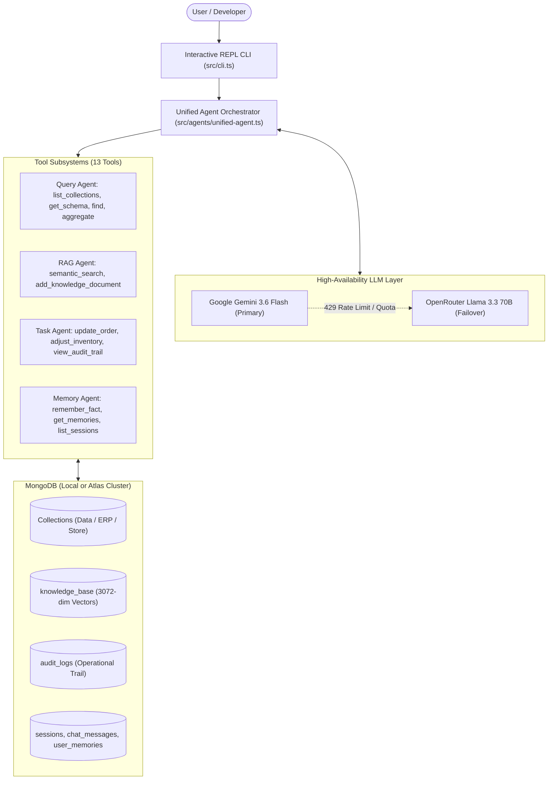

# 🍃 MongoDB AI Super Agent 🤖

[](https://www.typescriptlang.org/)
[](https://nodejs.org/)
[](https://www.mongodb.com/)
[](https://ai.google.dev/)
[](https://openrouter.ai/)
[](https://opensource.org/licenses/MIT)

An enterprise-grade, autonomous AI database agent for **MongoDB**. Query your database in plain English, perform semantic vector search (RAG), trigger operational tasks with transactional audit logging, and retain long-term memory across sessions — with zero-downtime **dual-LLM failover** between Google Gemini and OpenRouter.

Point it to any MongoDB database (from local collections to massive multi-collection production databases like ERPs, CRMs, or E-commerce stores) and start querying instantly.

---

## ✨ Key Features

- **🗣️ Natural Language Text-to-MQL & Aggregations:** Converts plain language questions into native MongoDB `find` filters and multi-stage aggregation pipelines (`$group`, `$lookup`, `$match`, `$sort`, `$project`) automatically.
- **🔍 Hybrid Vector Search & RAG:** High-dimensional semantic search powered by `gemini-embedding-001` (3072 dimensions). Supports native **MongoDB Atlas `$vectorSearch`** with seamless fallback to in-memory cosine similarity for local MongoDB instances.
- **⚙️ Autonomous Operational Tasks:** Safely executes write operations (e.g., updating orders, restocking inventory) with automatic change tracking recorded into an `audit_logs` collection.
- **🧠 Long-Term Memory & Conversation Persistence:** Stores chat history, active user sessions, and autonomously learned user preferences/facts in MongoDB (`sessions`, `chat_messages`, `user_memories`).
- **🛡️ Enterprise Dual-LLM Redundancy:** When Google Gemini hits Free Tier rate limits (`429` / quota exhaustion), the agent **automatically fails over to OpenRouter (`meta-llama/llama-3.3-70b-instruct`)** with zero interruption and preserved multi-turn context.
- **⚡ Dynamic Schema Introspection:** Intelligently discovers collection names and on-demand field types on the fly. Works out-of-the-box on databases with 100+ collections without token prompt bloat.

---

## 🏛️ Architecture



---

## 🛠️ The 4 Autonomous Stages

| Stage | Capability | Description |
|---|---|---|
| **Stage 1** | **Text-to-MQL Query Engine** | Inspects collection structures dynamically, filters documents, and builds advanced aggregation pipelines without writing raw MongoDB queries. |
| **Stage 2** | **Semantic Vector RAG** | Indexes knowledge articles and product descriptions into 3072-dimensional vector embeddings to answer unstructured questions and provide semantic recommendations. |
| **Stage 3** | **Operational Task Execution** | Modifies records, creates new documents, handles inventory balances, and produces an immutable audit trail for compliance. |
| **Stage 4** | **Persistent Long-Term Memory** | Tracks user persona, remembers user facts across conversations, and maintains session continuity in MongoDB. |

---

## 🚀 Quickstart Guide

### 1. Prerequisites

- **Node.js** >= 18.0.0
- **MongoDB** >= 6.0 (Local instance running on `localhost:27017` or a MongoDB Atlas URI)
- **Google Gemini API Key** (Get one free at [Google AI Studio](https://aistudio.google.com/))
- *(Optional, recommended)* **OpenRouter API Key** for failover redundancy ([openrouter.ai](https://openrouter.ai/))

### 2. Installation

Clone this repository and install dependencies:

```bash
git clone https://github.com/your-username/mongodb-ai-agent.git
cd mongodb-ai-agent
npm install
```

### 3. Environment Configuration

Copy the example environment file:

```bash
cp .env.example .env
```

Configure your `.env` file:

```env
# Primary Provider: Google Gemini
GEMINI_API_KEY=your_gemini_api_key_here
GEMINI_MODEL=gemini-3.6-flash

# Fallback Provider: OpenRouter (Optional, for automatic 429 failover)
OPENROUTER_API_KEY=your_openrouter_api_key_here
OPENROUTER_MODEL=meta-llama/llama-3.3-70b-instruct

# MongoDB Connection
MONGODB_URI=mongodb://localhost:27017
MONGODB_DATABASE=mongodb_ai_agent_db
```

> **Tip:** You can change `MONGODB_DATABASE` to any existing database on your cluster (e.g., your own ERP, e-commerce, or SaaS database).

### 4. (Optional) Seed Sample Data

If starting fresh without existing data, seed sample e-commerce records and vector knowledge base:

```bash
# Seed sample customers, products, and orders
npm run seed

# Seed knowledge articles and generate 3072-dim embeddings
npm run seed:vectors
```

### 5. Launch the AI Agent

Start the interactive terminal CLI:

```bash
npm run dev
```

---

## 💻 Interactive CLI Commands

Inside the agent terminal, special management commands are available:

| Command | Description |
|---|---|
| `memory` | View all long-term facts the AI has autonomously remembered about you. |
| `sessions` | Display all past and current conversation sessions. |
| `new` | Reset context and start a brand new conversation session. |
| `clear` | Clear the terminal console. |
| `exit` | Gracefully disconnect from MongoDB and quit. |

---

## 💡 Example Queries to Try

### 📊 Database Analytics & Aggregations
```text
Ask > Which top 3 product categories generated the highest revenue?
Ask > What is our total pending order volume and the average order value?
Ask > Show me all customers who placed an order in the last 30 days.
```

### 🔍 Semantic Vector Search & Recommendations
```text
Ask > Suggest ergonomic furniture suitable for developers with lower back discomfort.
Ask > What is our store's policy if a customer receives a broken or damaged item?
Ask > Explain our return and refund window.
```

### ⚡ Operational Actions & Audit Logging
```text
Ask > Update order #ORD-1002 status to Shipped and set tracking to TRK-99214.
Ask > Restock 50 units for product SKU-442.
Ask > Show me the latest 5 database audit log entries.
```

### 🧠 Personalized Long-Term Memory
```text
Ask > Please remember that I am the lead supply chain manager and prefer concise tables.
Ask > What are my key responsibilities and preferences that you have saved?
```

---

## 🔌 Connecting to Your Own Existing Database

The agent was built from the ground up to plug into any existing MongoDB database:

1. Open `.env` and set `MONGODB_DATABASE=your_production_db`.
2. Start the agent: `npm run dev`.
3. The agent will automatically:
   - Read collection names without dumping entire schemas (saving LLM token usage).
   - Inspect specific collection schemas on-demand when a relevant question is asked.
   - Execute targeted read/write operations accurately based on your actual document field types.

---

## 🗂️ Project Structure

```text
mongodb-ai-agent/
├── src/
│   ├── agents/
│   │   ├── memory-agent/          # Session management & user memory store
│   │   │   ├── store.ts
│   │   │   └── tools.ts
│   │   ├── query-agent/           # Schema inspection & Text-to-MQL engine
│   │   │   └── tools.ts
│   │   ├── rag-agent/             # Atlas Vector Search & cosine similarity
│   │   │   └── tools.ts
│   │   ├── task-agent/            # Write actions & transactional audit trail
│   │   │   └── tools.ts
│   │   └── unified-agent.ts       # Central orchestrator & dual-LLM fallback logic
│   ├── config/
│   │   ├── db.ts                  # MongoDB connection pool manager
│   │   └── env.ts                 # Type-safe environment validation (Zod)
│   ├── data/
│   │   ├── seed.ts                # Sample operational dataset
│   │   └── seed-knowledge.ts      # Knowledge base seed & embedding generation
│   ├── llm/
│   │   ├── embeddings.ts          # Gemini embedding-001 service
│   │   ├── gemini.ts              # Google GenAI SDK interface
│   │   └── openrouter.ts          # OpenAI-compatible OpenRouter caller
│   └── cli.ts                     # Terminal REPL interface
├── .env.example                   # Environment template
├── package.json                   # Scripts and project dependencies
├── tsconfig.json                  # TypeScript compiler configuration
└── README.md                      # Project documentation
```

---

## 🔒 Security & Best Practices

- **Strict Tool Scoping:** Database operations are restricted to structured agent tools. Arbitrary code or script execution (`eval`) is disabled.
- **Audit Logging:** Every database write, status update, and inventory change logs the timestamp, actor, collection, target document ID, and operation payload into `audit_logs`.
- **Safe Aggregation:** Pipelines are executed via standard MongoDB driver methods with bounded result sets (`limit: 50`) to prevent memory exhaustion.
- **Failover Security:** Fallback to secondary providers passes only the current message history and relevant tool responses without leaking environment configurations.

---

## 🤝 Contributing

Contributions, bug reports, and feature requests are welcome!

1. Fork the Project
2. Create your Feature Branch (`git checkout -b feature/AmazingFeature`)
3. Commit your Changes (`git commit -m 'Add some AmazingFeature'`)
4. Push to the Branch (`git push origin feature/AmazingFeature`)
5. Open a Pull Request

---

## 📄 License

Distributed under the **MIT License**. See `LICENSE` for more information.
